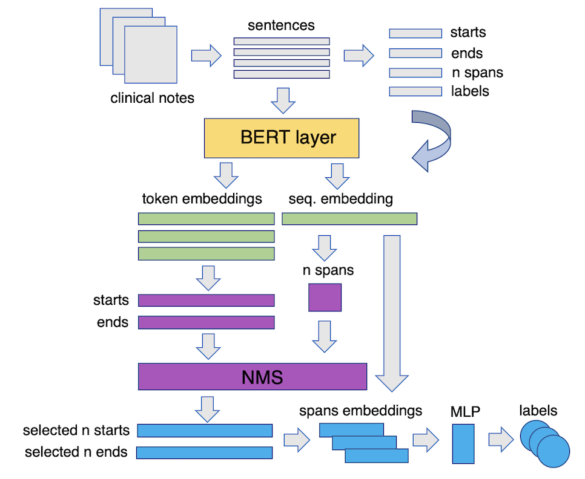

# Detecting the Clinical Features of Difficult-to-Treat Depression using Synthetic Data from Large Language Models.
The code in this repository can be used to train a model to extract spans for psychiatric clinical features from text and label them. It uses a custom Pytorch model which extracts multiple spans from sentences by predicting starts, ends and number of spans and applying a variant of Non-Maximum Suppression (NMS) to select the top non-overlapping predicted spans, then uses a separate classifier to label the spans and finally max pools the softmaxed probabilities for each span (at training time) or selects the argmax label for each predicted span (at inference time). We successfully used this code to train a model on synthetic annotated clinical notes for factors influencing likelihood of difficult-to-treat depression (DTD). 

The code and dataset are described in our preprint paper at http://arxiv.org/abs/2402.07645





## Dependencies
Please create a virtual environment, cd inside repo and run 
    
    pip install -r requirements.txt

## Training 
The model can be trained by running `train.py` with the relevant arguments, e.g., 
    
    python -m train.py --path_sentence_df ../synthetic_data/12_02_2024_final_df.csv 


By default, it will output the trained model with filename `model_{date}_{time}.pt`. If you wish to change the filename, add command line argument following `train.py`

## Inference 
Once you have trained the model, you can use it in the following way: 

    import torch
    import re
    from utils import create_label_dict
    from transformers import BertTokenizerFast
    from models import SpanClassifier
    device = torch.device('cpu')

    bert_path = 'bert-base-uncased'
    num_labels = 41
    max_spans = 9
    batch_size = 16

    d = create_label_dict()
    rev_d = {v:k for k,v in d.items()}
    tokenizer = BertTokenizerFast.from_pretrained(bert_path)
    checkpoint = torch.load('model.pt')
    model = SpanClassifier(bert_path=bert_path, 
                        batch_size=batch_size, 
                        num_labels=num_labels, 
                        dropout_rate=0.5, 
                        max_spans=max_spans,
                        level='span').to(device)

    model.load_state_dict(checkpoint)
    model.eval()

    def get_preds(sent, model=model, tokenizer=tokenizer, rev_d=rev_d):
        encoded_input = tokenizer(sent, return_offsets_mapping=True, return_tensors='pt')
        input_ids = encoded_input['input_ids']
        masks = encoded_input['attention_mask']
        segs = encoded_input['token_type_ids']

        start_logits, end_logits, label_logits, n_spans_logits, pol_logits, 
        preds_starts, preds_ends, preds_labels, ordered_preds = model(input_ids = input_ids, masks=masks, segs=segs)
        output = {'text': sent, 'spans': []}
        for pred in ordered_preds:
            for i in pred:
                start_token = int(i[0])
                end_token = int(i[1]) + 1
                start_idxs = encoded_input['offset_mapping'][0][:,0]
                end_idxs = encoded_input['offset_mapping'][0][:,1]
                char_start = start_idxs[start_token]
                char_end = end_idxs[end_token-1]
                output['spans'].append({'start':int(char_start), 'end':int(char_end), 
                'label': rev_d[int(i[2])], 'confidence': float(i[3])})
            return output

    sentence = '''
    XXXXX has been inpatient twice for mental health treatment due to severity 
    of illness with recurrent episodes of major 
    depressive disorder occurring approximately every 3-4 months.
    '''
    print(get_preds(sentence))

This will output a dictionary with keys `text` and `spans`. The latter is a list of extracted spans with start, end, label and confidence values. For `family_member_mental_disorder`, we recommend a threshold of 0.8 confidence for good performance (i.e., only extracting spans above 0.8 confidence). 

# Citation

If you use the code in this paper, please use the following citation:

<!-- @misc{lorge2024detecting,
title={Detecting the Clinical Features of Difficult-to-Treat     Depression using Synthetic Data from Large Language Models}, 
author={Isabelle Lorge and Dan W. Joyce and Niall Taylor and Alejo Nevado-Holgado and Andrea Cipriani and Andrey Kormilitzin},
year={2024},
eprint={2402.07645},
archivePrefix={arXiv},
primaryClass={cs.CL}} -->

 ``` 
 @article{LORGE2025110246,
title = {Detecting the clinical features of difficult-to-treat depression using synthetic data from large language models},
journal = {Computers in Biology and Medicine},
volume = {194},
pages = {110246},
year = {2025},
issn = {0010-4825},
doi = {https://doi.org/10.1016/j.compbiomed.2025.110246},
url = {https://www.sciencedirect.com/science/article/pii/S0010482525005979},
author = {Isabelle Lorge and Dan W. Joyce and Niall Taylor and Alejo Nevado-Holgado and Andrea Cipriani and Andrey Kormilitzin},
keywords = {DTD, LLM, ML, Synthetic data}
}
```

      